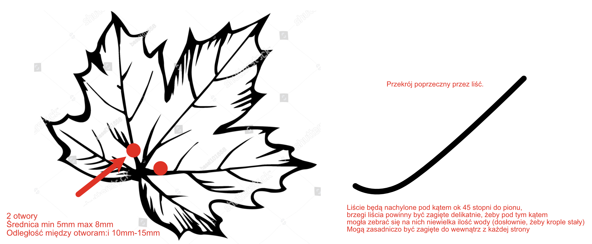

# Ceramiczny dysperser do wodospadu — wymagania

1. Ceramika: czarna, szkliwiona na połysk
2. Liście w trzech rozmiarach, odpowiednio do naturalnych liści klonu. 14x duży liść, 14x średni liść, 14x mały liść
3. 2 otwory w każdym liściu, przy podstawie — średnica od 5mm do 8mm, odległość od 10 do 15mm pomiędzy nimi
4. Każdy liść lekko zagięty na brzegach i do wewnątrz (skulony), tak, żeby niewielka ilość wody mogła się tam zebrać (one będą zamontowane pod kątem 45 stopni do pionu)

